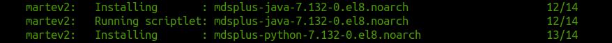

# vagrant_martev2_vm
Vagrant AlmaLinux 8.9 VM creation for martev2 workspace for development purpose

## System requirements
* CPU : Atleast 4 [2 CPUs are for VM]
* Memory : Atleast 4GB [2GB for VM]

## Vagrant Providers Support
* Oracle Virtual-Box [Windows and Linux]
* Libvirt [Linux Only]

## How to setup NFS server in host machine
* Please follow the instructions [https://developer.hashicorp.com/vagrant/docs/synced-folders/nfs]

## How to create VM on Oracle Virtual-Box
* Install Oracle VirtualBox [https://www.virtualbox.org/wiki/Downloads]
* Install Vagrant [https://developer.hashicorp.com/vagrant/install]
* git clone https://github.com/balamuruganky/vagrant_martev2_vm
* cd vagrant_martev2_vm
* vagrant up [By default, Oracle Virtual-Box is the provider, if it is installed.]

## How to use KVM on Linux instead of using Oracle VirtualBox
* Install Vagrant [https://developer.hashicorp.com/vagrant/install]
* git clone https://github.com/balamuruganky/vagrant_martev2_vm
* cd vagrant_martev2_vm
* vagrant up --provider libvirt

## How to login to VM
* vagrant ssh
* cd martev2_ws [MARTev2 workspace containing all the necessary builds]

## How to shutdown the VM
* vagrant halt

## How to destroy the VM
* vagrant destroy

## Bug
* The 'vagrant up' strucks before cloning the martev2 codebase from github.

* Press "Ctrl+C".
* Login to the VM [vagrant ssh].
* Shutdown the VM [sudo shutdown now].
* Delete the "martev2_ws" [rm -rf marteve2_ws] folder in host machine.
* Create the "martev2_ws" [mkdir marteve2_ws] folder in host machine.
* Start the VM provision [vagrant up --provision].

## Network
This VM has no public IP assigned. Please use "nmtui" utility in AlmaLinux VM to configure the network.

## Useful links
* https://developer.hashicorp.com/vagrant/docs/providers
* https://developer.hashicorp.com/vagrant/docs/plugins

